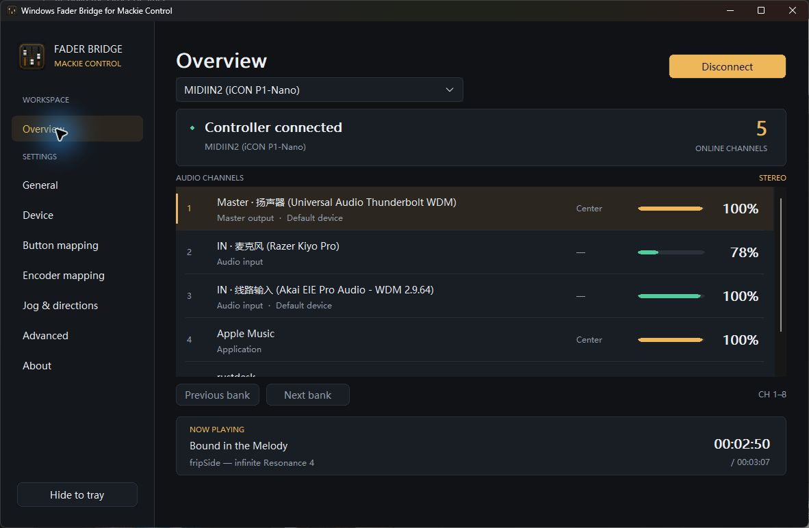
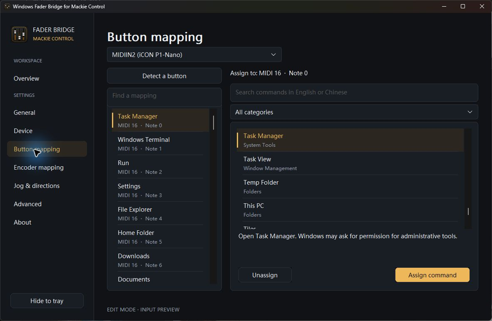
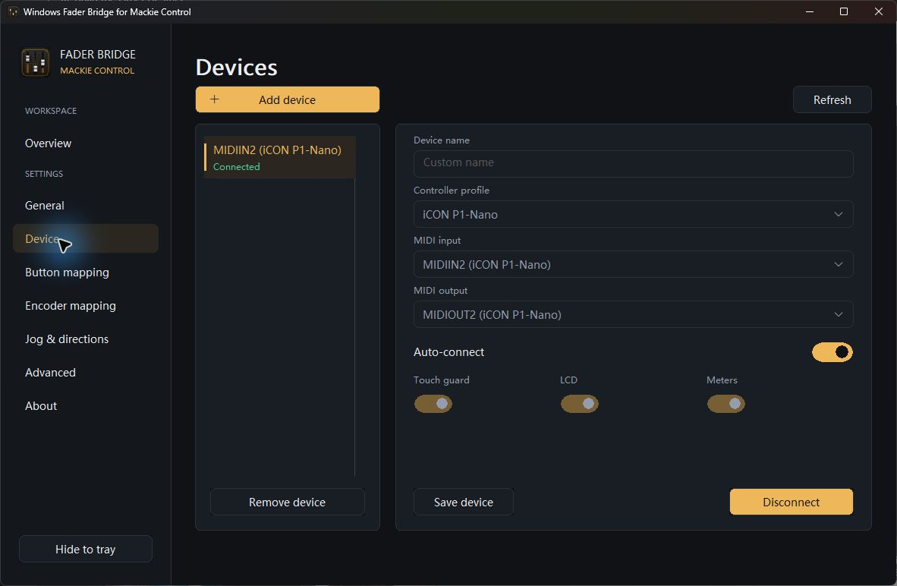
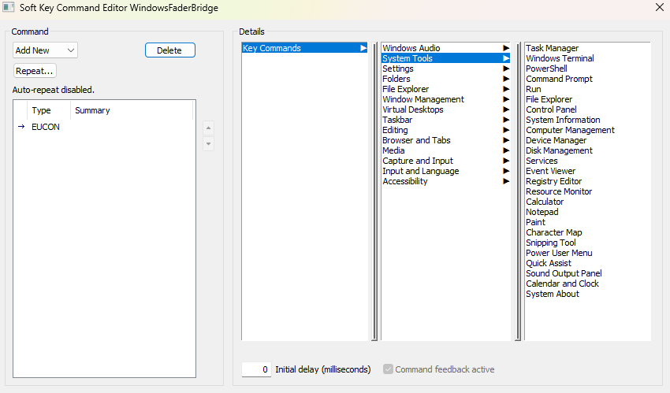
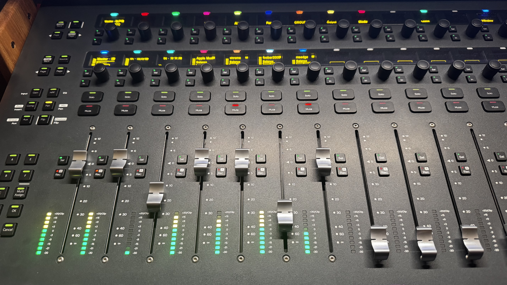

# Windows Fader Bridge

Current application version: **v1.0.0**. This version is shared by Windows
Fader Bridge for EUCON, Windows Fader Bridge for Mackie Control, and UAD Console
Bridge for EUCON. Protocol, settings-schema, SDK and dependency versions remain
independent.

Native Windows audio control from your control surface: application volume,
pan, mute, solo, meters and everyday Windows commands.

Two independent applications share the project:

| Edition | Connection | Validation hardware |
| --- | --- | --- |
| **Windows Fader Bridge for EUCON** | Avid EUCON runtime / EuControl | Avid S3 and Avid Control on iPad |
| **Windows Fader Bridge for Mackie Control** | Standard Mackie Control (MCU) over MIDI | iCON P1-Nano in Cubase/MCU mode |

These are protocol adapters, not device-specific drivers. Each edition has its
own executable, settings and lifecycle. P1-Nano is the first Mackie test device,
not a requirement; other MCU controllers use the same protocol implementation.

## UAD Console Bridge for EUCON — development preview

A separate **UAD Console Bridge for EUCON** is being developed for the Apollo DSP
mixer. The current checkpoint observes UA Mixer Engine state and contains a
standard EUCON feedback adapter with independently armed, multi-channel fader,
mute, solo and independent left/right pan control. The development build also
maps AUX/Cue sends to AUX, output destinations to MIX, supported native preamp
controls to Input, and loaded plug-in parameters to Inserts child pages.
Input also offers channel-type-specific line reference/SRC, AUX PRE/POST/MONO,
and TALK/TB-to-monitor controls. Empty insert slots show None. Channel colors
distinguish input families. By explicit user choice, the channel Rec button/LED
selects UAD REC/MON (effects printed vs dry DAW feed), not DAW record arming.
Startup is read only by default; restoring confirmed permissions at startup is
an explicit opt-in. Reconnection never automatically restores write access.
A separate standard EUCON control-room
processor provides monitor level, Mute, Dim, Mono, dim depth, source selection
and TALK behind its own explicit unlock and session level ceiling. The monitor
is never a channel-strip fader. Phantom activation and talkback to monitor
require the separate sensitive-control permission.
Loaded UNISON plug-ins have a separate, metadata-driven parameter area in the
upper Channel Control hierarchy; raw UNISON gain curves are still never guessed.
Confirmed self-authored routing refreshes
the same channel's permission without disrupting other channels.
**New channel/monitor features await S3 and Avid Control acceptance; this is not
a production Apollo controller.**
The new English / Simplified Chinese desktop presents status only. Settings
contain independent permission scopes, a configurable monitor ceiling (up to
0 dB), tray behavior and optional Windows sign-in startup. CONFIG features remain
experimental and opt-in. The previous dashboard is private (`--diagnostics`).
The existing Windows Fader Bridge editions remain independent and unchanged.

See the [Chinese user guide](docs/UAD_CONSOLE_BRIDGE_GUIDE_ZH.md),
[English user guide](docs/UAD_CONSOLE_BRIDGE_GUIDE_EN.md),
[control mapping / legacy diagnostics](docs/APOLLO_GUIDE_ZH.md) and
[research / verification record](docs/APOLLO_RESEARCH.md). SDK-free tests can be
run with `scripts/build-apollo.ps1 -CoreOnly`; the EUCON host requires a
separately obtained Avid SDK. No vendor SDK, manual or example is redistributed.

## Windows Fader Bridge for Mackie Control

A native desktop workspace in **English and Simplified Chinese**, with an
independent Mackie-only icon, background operation and optional Windows startup.

- Live Windows output, input and application channels, with volume, pan, mute,
  solo and peak-meter feedback. Offline channels are removed automatically;
  stable identities and touch protection prevent a gesture from moving to a
  different application during channel-list changes.
- Eight-strip MCU banking plus master. For the current-channel encoder workflow,
  encoder 1 controls volume, encoder 2 controls pan (press to center), and
  encoders 3–8 have separate left/right/press command assignments.
- Transport control, song/artist information and elapsed playback time where
  Windows media sessions provide them. The numeric surface display falls back
  to the system clock when idle. Player support varies; readable progress does
  not necessarily mean seeking is supported.
- A searchable, categorized browser for **186 Windows commands**, with command
  descriptions and separate button, encoder and Jog/Move/Zoom assignments.
  Ordinary Jog defaults to playback seeking; Navi/Focus retain native semantics.
- **＋ Add device** manages up to 16 independent main controllers, each with its
  own MIDI pair, connection setting and mappings. Auto-connect is enabled by
  default for explicitly saved, uniquely identifiable ports only. Manual
  disconnect pauses automatic retry for the current run.
- An optional 80-key touchscreen preset generator for P1-Nano, based on the
  user's own iMAP export. It preserves other DAW slots and non-touch controls;
  no vendor preset or configuration file is redistributed.

### Screenshots — English interface

#### Live mixer and playback information



#### Searchable Windows command assignments



Select a control on the left, search or browse commands on the right, read its
description and choose **Assign command**. While editing, custom input from the
selected device is previewed rather than executed; other devices keep working.

#### Device settings and automatic connection



Screenshots show the real application. Windows-supplied device and application
names retain their original language even when the interface is English.

### Build and first connection

Requires Windows 11 x64, Visual Studio 2022 v143 C++ build tools and a Windows
SDK. **No Avid SDK, EuControl or iCON software is required to build this edition.**

```powershell
.\scripts\build-mackie.ps1
```

Output: `artifacts/mackie/Release/WindowsFaderBridge.Mackie.exe`.

1. Put the controller in Mackie Control/MCU mode; use Cubase mode for P1-Nano.
2. Open **Settings → Device**, select the controller profile and matching MIDI
   input/output, then **Save device**. Saved ports connect automatically unless
   you switch Auto-connect off; manual mode uses **Connect device**.
3. Use **Button mapping**, **Encoder mapping** or **Jog & directions** to assign
   commands. Return to Overview to use them. Change language in **General**.
4. Add another independent controller with **＋ Add device**, using a different
   MIDI pair. Do not share the same ports with another application or select a
   maintenance/iMAP port.

Default builds run protocol/settings and preset-generator tests without opening
MIDI ports or changing audio. `-AudioIntegration` opts into a test that controls
only its own silent Windows audio session.

### Compatibility and limits

Core workflows have been tested with the owner's P1-Nano. Pure tests cover
independent device state, port safety and configuration migration, but **two
physical controllers operating together have not yet been verified**. There is
no claim of certified compatibility with every MCU device. HUI, MCU Extender
aggregation and manufacturer-specific handshakes/display extensions are not
implemented. Media controls depend on each player's Windows integration.

See the [Chinese Mackie guide](docs/MACKIE_GUIDE_ZH.md) and
[touchscreen setup guide](docs/MACKIE_TOUCHSCREEN_ZH.md), plus the
[desktop workflow](docs/MACKIE_DESKTOP_UI.md) and
[protocol/source/verification notes](docs/MACKIE_RESEARCH.md).

## Windows Fader Bridge for EUCON

The EUCON edition publishes a device-independent application model through the
native EUCON 2026.4 SDK. Avid's runtime owns discovery, assignment and banking.

### Windows application


The EUCON screenshots below were captured before the edition suffix was added.
The displayed product name is now **Windows Fader Bridge for EUCON**. Its existing
executable name, startup identity and EUCON registration identity are retained
for compatibility with saved configurations and surface assignments.

### Assignable commands in EuControl



### Avid Control on iPad


A physical control surface is optional. EuControl can expose the same Windows
mixer model to Avid Control on an iPad, providing software faders, meters,
channel colors, mute, solo, pan, banking and soft-key access.

### EUCON surface in use



The pictured surface is validation hardware, not a device-specific dependency.
Windows Fader Bridge publishes a device-independent EUCON application model and
leaves surface discovery, assignment and banking to the Avid EUCON runtime.

### EUCON features

`src/FaderBridge.EuconHost` is a native x64 EUCON application. It currently
provides:

- event-driven Windows Core Audio session discovery and updates;
- one virtual EUCON channel per active Windows audio application;
- EUCON-managed assignment, layouts and banking across the virtual track list;
- bidirectional fader, encoder, mute, OLED label and position-ring sync;
- per-application peak meters using EUCON Meter API 3.1 with a temporary
  regular-meter compatibility fallback;
- stable application persistence IDs for EuControl assignments and layouts;
- per-application EUCON channel colors derived from Windows app/package icons,
  with a stable fallback palette;
- direct Core Audio writes on an MMCSS worker for low control latency.
- 186 freely assignable EUCON soft-key commands across Windows Audio, system
  tools, Settings, folders, File Explorer views, window management, taskbar,
  virtual desktops, editing, browser tabs, media, capture/input, input methods,
  and accessibility;
- a native dark status window, professional mixer icon, system-tray background
  operation, single-instance activation, diagnostics access, and optional
  per-user startup with Windows.

Closing the main window or choosing **Hide to tray** keeps the bridge running.
Double-click the tray icon to reopen it, or use the tray menu to open, configure
startup, or fully exit. Startup launches with `--background`, so no window is
shown until requested.

The application fader mapping is intentionally linear: table coordinates
`-9600..0` map to Windows volume `0..100%`. The region above 0 dB is treated as
physical overtravel and rebounds to Windows 100%.

### Build the EUCON edition

Requirements:

- Windows 11 x64;
- Avid EUCON Application SDK and Workstation Unified 2026.4, obtained
  separately from Avid and used under Avid's own license;
- Visual Studio 2022 v143 C++ build tools.

```powershell
powershell -ExecutionPolicy Bypass -File .\scripts\build-eucon.ps1
```

The executable is written to
`artifacts/eucon/Release/WindowsFaderBridge.exe`.

The Avid SDK, headers, libraries, documentation, examples, installers and
EuControl software are **not** part of this repository. Obtain the SDK from
the [official Avid EUCON Application SDK page](https://developer.avid.com/eucon/),
accept Avid's applicable terms, and install it locally before building. See
[`docs/BUILDING.md`](docs/BUILDING.md) for complete setup instructions and a
custom SDK-path example.

Only one EUCON test application should run at a time. The SDK, EuControl
installer, build artifacts and diagnostic logs are deliberately excluded from
Git.

## Repository status

This is an active hardware-research project, not a finished release. The public
source tree contains only Windows Fader Bridge project material. Proprietary
Avid SDK content and privately collected research material are deliberately
excluded.

The generic integration contract is recorded in `docs/EUCON_ARCHITECTURE.md`;
the assignable command catalog is documented in `docs/WINDOWS_COMMANDS.md`, and
the Chinese command manual is in `docs/WINDOWS_COMMANDS_ZH.md`. Device-specific
verification evidence is also under `docs/`.

## License

Windows Fader Bridge source code is available under the
[Mozilla Public License 2.0](LICENSE). MPL-2.0 requires modifications to covered
source files to remain available under the same license while allowing the
project to interoperate with separately licensed system and SDK components.

MPL-2.0 does not grant any rights to Avid software, documentation, trademarks,
SDK files or EUCON technology supplied by Avid. See
[`THIRD_PARTY_NOTICES.md`](THIRD_PARTY_NOTICES.md).
